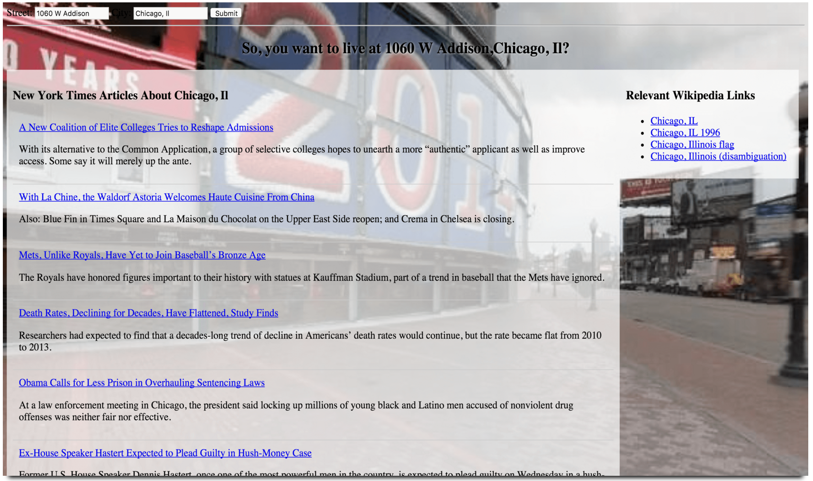

#[Move-Planner-App](http://samurairanderson.github.io/Move-Planner-App)

This is a project for Udacity which utilizes AJAX, and API's, to create a move planner. A 
user can enter anaddress and see the 
[Google Street View](https://www.google.com/maps/views/streetview?gl=us) of the queried 
address, [New York Times](http://www.nytimes.com/) articles relating to the area, and 
[Wikipedia](https://www.wikipedia.org/) information relevant to their search.

You can try out this application by clicking [**here**](http://samurairanderson.github.io/Move-Planner-App)! 

